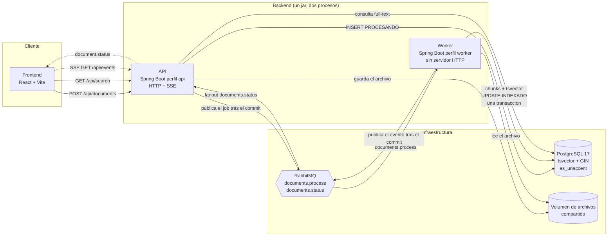

# Arquitectura

> Documento vivo. Se completa en cada fase; las secciones marcadas como pendientes se
> cierran cuando la funcionalidad correspondiente exista.

## Diagrama de Arquitectura / Flujo

Flujo de carga (HU-01) y de indexacion (HU-04):

1. La API valida el archivo y los metadatos, lo guarda con un nombre generado, inserta la
   fila con estado `PROCESANDO` y responde `202` de inmediato con el identificador de
   seguimiento. El job se publica **despues** del commit.
2. El worker extrae el texto, lo divide en fragmentos y, en **una sola transaccion**,
   reemplaza los fragmentos, calcula su `tsvector` y marca el documento `INDEXADO`. El
   evento de estado se publica **despues** del commit.
3. Cada instancia de la API recibe el evento por un exchange fanout y lo reenvia a sus
   propios clientes SSE.

## Justificación de Decisiones

| Decisión                                       | Motivo                                                                                                                                                           |
| ---------------------------------------------- | ---------------------------------------------------------------------------------------------------------------------------------------------------------------- |
| PostgreSQL Full-Text Search (`tsvector` + GIN) | El spec prohibe `LIKE`. La base de datos ya es necesaria para la persistencia; anadir un motor externo sumaria una pieza operativa sin beneficio a este volumen. |
| `JdbcClient` con SQL explicito, sin JPA        | La consulta de busqueda es el nucleo del ejercicio y debe poder leerse y pasarse por `EXPLAIN` sin capas intermedias.                                            |
| Configuracion de texto `es_unaccent`           | Permite que "especificacion tecnica" encuentre "Especificación técnica". Verificado sobre `postgres:17-alpine` en la fase 0.                                     |
| Worker como proceso aparte                     | La extraccion de PDF es intensiva en CPU; aislarla evita que compita con los hilos que atienden peticiones.                                                      |
| RabbitMQ en vez de una cola en memoria         | Los jobs sobreviven a un reinicio, se reintentan con backoff y terminan en una dead-letter queue cuando fallan de forma determinista.                            |
| Publicar solo tras el commit                   | Evita que el worker reciba un job cuya fila aun no esta confirmada.                                                                                              |
| SSE en vez de WebSocket                        | El flujo es unidireccional (servidor a cliente). SSE reconecta solo y atraviesa proxies HTTP sin negociacion adicional.                                          |
| Contrato TypeScript generado desde OpenAPI     | Los DTO de Java son la unica fuente de verdad; CI falla si el contrato publicado difiere.                                                                        |

_Pendiente: justificar el modelo de datos y la estrategia de chunking cuando se implementen (fases 2 y 3)._

## Estrategia de Tiempo Real

- Transporte: **Server-Sent Events**. El frontend abre **un unico** `EventSource` al
  arrancar la aplicacion, nunca uno por documento.
- El worker publica en el exchange fanout `documents.status`. Cada instancia de la API se
  une con una cola exclusiva y autoeliminable, de modo que el evento llega a todas las
  instancias y cada una lo reenvia a sus clientes conectados.
- Se envia un comentario de heartbeat cada `APP_SSE_HEARTBEAT_MS` para que los proxies no
  cierren la conexion por inactividad.
- **No hay polling de ningun tipo.** Al reconectar se hace una unica lectura de
  reconciliacion de los documentos que el cliente aun ve en `PROCESANDO`.

_Pendiente: detallar el registro de emisores y el manejo de desconexiones (fase 5)._

## Interpretación del SLA (400 ms – 1 s)

El spec pide tiempos de respuesta "entre 400 ms y 1000 ms" y el checklist de evaluacion
habla de un tiempo "**optimizado** entre 400 ms y 1 s". Se interpreta como un **techo duro
de 1 s** para p95/p99, no como un suelo: una busqueda mas rapida es mejor, nunca peor.
**No se anade latencia artificial** para "alcanzar" los 400 ms.

Mecanismos que hacen cumplible ese techo:

- `statement_timeout` por transaccion con valor `APP_SEARCH_TIMEOUT_MS`; el SQLSTATE 57014
  se traduce a `503 application/problem+json`.
- Tamano de pagina acotado por `APP_SEARCH_MAX_PAGE_SIZE`.
- `ts_headline` se ejecuta **solo sobre la pagina devuelta**, nunca sobre todas las
  coincidencias.
- Indice GIN sobre `search_vector`.

_Pendiente: cifras reales de p50/p95/p99 (fase 8)._

## Escalabilidad

- **API**: sin estado salvo las conexiones SSE abiertas. Escala horizontalmente; el fanout
  de RabbitMQ garantiza que el evento llegue a la instancia que sostiene cada cliente.
- **Worker**: escala de forma independiente a la API. El paralelismo se controla con
  `APP_WORKER_CONCURRENCY` y `prefetch 1`, para repartir los documentos grandes.
- **PostgreSQL**: la busqueda se apoya en un indice GIN; el crecimiento se absorbe con
  replicas de lectura y, si hiciera falta, particionando `document_chunks`.
- **Puertos de salida**: `SearchEngine`, `FileStorage`, `JobPublisher` y
  `StatusEventPublisher` son interfaces, de modo que sustituir PostgreSQL FTS por
  OpenSearch, o el disco local por S3, no toca los casos de uso.

_Pendiente: medir el punto en el que conviene mover la busqueda a un motor dedicado._

## Resultados de benchmark

_Pendiente (fase 8): p50/p95/p99 de `/api/search` y salida de `EXPLAIN (ANALYZE, BUFFERS)`
que demuestre el uso del indice GIN._

## Trade-offs y fuera de alcance

Fuera de alcance, declarado de forma explicita:

- Autenticacion y autorizacion.
- OCR para PDF sin capa de texto: se marcan como `ERROR` con el codigo
  `PDF_NO_TEXT_LAYER`.
- Multi-tenancy.
- Edicion y borrado de documentos.
- Internacionalizacion de la interfaz: la copy esta en espanol, centralizada en
  `frontend/src/copy/es.ts`.

Trade-offs asumidos:

- Almacenamiento en un volumen compartido en vez de un object store: suficiente para el
  alcance del ejercicio y sin dependencias externas.
- Sin ORM: mas SQL escrito a mano a cambio de control total sobre la consulta de busqueda.
